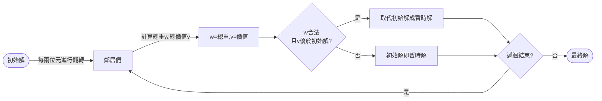

# 🔵 Ⅱ. 超啟發式演算法
## 1. Hill Climbling
---
### 12/17 更新(平滑化)
* **原本(問題)**：
    * 沒有適當利用「爬山演算法」一步步爬(找鄰居)的特性，在前幾次爬的過程中，很快就遇到第一個「山頂」，導致進退兩難卡在那邊(圖A)
* **原本(發現)**：
    * 每隔1 bit 就進行翻轉，經觀察，最大的原因是：前幾部的路線已經**背好背滿**，很容易就超過容量。故我將找鄰居的過程做了優化。


`圖A`

---
* **優化：找鄰居**：
    1.  將binary數分成前半、後半(權重輕、權重重)(已由小 → 大排序)
    2. 〔加一個，減一個〕操作都要從【前半、後半】中選一個(每次由隨機機率決定)
   3. 若剛好前半、後半都無法再加減
   4. 則隨機取一位元做翻轉
* **優化：想法**：
    * 設計這樣的方式主要是為了，捨輕取重/捨重取輕，讓容量部會一直備受限制，而是可來回做比對、修正(圖B)

    ```python
    ------- (callee)
    def delOrAdd_HeavyOrLight(list, mode):
        # mode=0做增加 , mode=1做刪減
        hasNeig = False; d = dict()
        indices = [i for i, x in enumerate(list) if x == mode]
        if(len(indices) >= 1): #刪一個輕的
            idx = random.choice(indices) #隨機挑一個1
            list[idx] = int(not mode)#刪
            hasNeig = True
        d['flag'] = hasNeig 
        d['new_oper_list'] = list 
        return d

    ------- (caller)
        doAdd = random.random() #前半、後半誰要做加
        doDel = random.random() #前半、後半誰要做減
        #加------
        if doAdd > 0.5: #重的+1
            res = delOrAdd_HeavyOrLight(end_list, 0)  #add Heavy
        else: #輕的+1
            res = delOrAdd_HeavyOrLight(front_list, 0) #add Light
        #減-------
        if doDel > 0.5: #重的-1
            res = delOrAdd_HeavyOrLight(end_list, 1) #del Heavy    
        else: #輕的-1
            res = delOrAdd_HeavyOrLight(front_list, 1) #del Light


    ```


`圖B`

---

### ◻ 方法
1. **流程圖**


### ◻ 想法&發現
* **初始解**：(同SA)
    * random一範圍 $(2^{n}/2)$ ~ $2^{n}$ 的數 initNum (decimal)
        * 測試後發現，取較大的數，意同盡量**取重量較輕的**，所需的迭代次數較少，故原範圍 $1$ ~ $2^{n}$ ，改成從 $(2^{n}/2)$ 開始取
        * eg. 11000 (24) 優於 10011(19)
    * initNum轉為binary並分割成list(array)
    * 計算總重 & 總價值
    * 但扔會卡在「區域最佳解」
* **生成鄰居**
    * 基本作法：有一n bit的二進位數，每一bit做翻轉，
        * 例：n=3時，001有 ***1***01、0***1***1，00***0***
        * 需做n次
    * 我的想法：每隔兩位元再做一次翻轉
        * 例：n=5時，01001有 ***1***1001、01***1***01，00100***0***
        * 只需一半的時間
        * 補充在 【◻ 結果】
### ◻ 結果
1. 由程式&收斂圖(圖一)可發現，爬山演算法：
    * `優點`：容易實作
    * `缺點`：容易卡在 **「區域最佳解」**
    
2. 鄰居
    * 使用我的想法`「每兩bit」翻轉`，在資料數n不夠大時，較**不易取得(最靠近的)最佳解** (圖二)
    * 固本題n=15下，選用`「每一bit」翻轉` (圖一)


`圖一`


`圖二`


### ◻ code review
> 省略部分Code，只擷取重要的部分
> 
> HC跟SA共用main.py程式碼，執行時可選擇要實施哪一個演算法
* **架構**
    ```
    |-- Knapsack   
    |--- p07_{c,p,w}.txt
    |--- main.py  
    |--- compoents.py  #功能函式們 (HC&SA共用)
    |--- varibles.py  #存放global變數&參數設定
    ```

1. **讀取txt檔**
    * 使用f stream讀取重量/容量/價值
   ```python
    for path in paths:
        f = open(path, 'r')
        if path == 'p07_c.txt' :
            varibles.capcity = int(f.read())
        ......
   ```
2. **Hill Climb演算法**
    * **初始化**
        * random"合法"的初始值/解
        * 並算出總價值&重量
        ```python
            compoents.initialState() #初始值/解

            def initialState():
                global best_state
                pickBound = math.pow(2, int(varibles.objNums)) #upperbound: 2^15
                min = int(pickBound/2) 
                
                while(1):
                    initNum = format(random.randrange(min, pickBound), 'b') #範圍: (2^15/2) - 2^15
                    blist = binToList(initNum) #拆成list
                    (w, v) = calTotalWandV(blist)  #計算weight & value

                    if w <= varibles.capcity: #是否合法
                        ......
        ```    
    * **main：開始執行500次迭代**
        ```python

            while i < varibles.iteraNum:
                stage = compoents.HillClimbing() 
                i += 1
        ```

    * **定義Neighbors鄰居**
        * 每元進行**翻轉**(0→1,1→0)    
        * 若**合法**(重量w符合)，且**更佳**(價值v大於原來的)，則**取代**初始解，成為新的初始解(暫時解)
         ```python

            def HillClimbing():
                temp_state = now_state.copy() #取得初始解
                for index, pick in enumerate(now_state['blist']): #遍歷每個位元
                    new_list = now_state['blist'].copy()
                    new_list[i] = int(not new_list[i])
                    (w, v) = calTotalWandV(new_list)
                    if w <= varibles.capcity: #合法
                        if v > temp_v: #新better than 舊
                            ......(取代)  
                #取代初始解,成為新的初始解(暫時解)
                NewState(temp_state['blist'], temp_state['weight'], temp_v)   
        ```
        
### ◻ 參考資料
 1. [PDF教學檔](https://athena.ecs.csus.edu/~gordonvs/215/WeeklyNotes/03A_hillClimbingSimulatedAnnealing.pdf)
