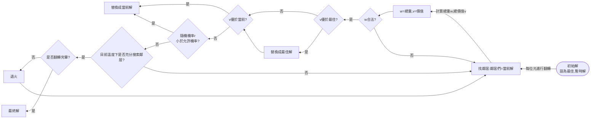

# 🔵 Ⅱ. 超啟發式演算法
## 2. Simulation Annealing

### ◻ 方法
1. **流程圖**


  
### ◻ 想法&發現
* **初始解**：
    * random一範圍$(2^{n}/2)$~$2^{n}$ 的數 initNum (decimal)
        * 測試後發現，取較大的數，意同盡量**取重量較輕的**，所需的迭代次數較少，故原範圍$1$~$2^{n}$，改成從$2^{n}$開始取
        * eg. 11000 (24) 優於 10011(19)
    * initNum轉為binary並分割成list(array)
    * 計算總重 & 總價值
* **生成鄰居**
    * 基本作法：有一n bit的二進位數，每一bit做翻轉，
        * 例：n=3時，001有 ***1***01、0***1***1，00***0***
        * 需做n次
    * 我的想法：每隔兩位元再做一次翻轉
        * 例：n=5時，01001有 ***1***1001、01***1***01，00100***0***
        * 只需一半的時間
* **初始溫度T，收斂速度RATIO**：
    * RATIO：
        * 大：降溫快，較早達平衡(穩定)，但也較可能找不到最佳解
        * 小：降溫慢，較耗時，但也容易達到最佳解
        * 根據測試RATIO>=0.85時，「幾乎」都可達最佳解，所以此題取=0.9為最佳
    * T： 影響解的搜索範圍
        * 根據測試T>150時，較快得到平衡，所以此題取=180為最佳

### ◻ 結果
1. 模擬退火演算法：
    * `優點`：較不易卡在「區域最佳解」
    * `缺點`：**「收斂成效」** 容易**被初始解、溫度等設定影響**，故有時需要較長的收斂時間，有時100次內即可
    


### ◻ code review
> 省略部分Code，只擷取重要的部分
* **架構**
    ```
    |-- Knapsack   
    |--- p07_{c,p,w}.txt
    |--- main.py  
    |--- compoents.py  #功能函式們 (HC&SA共用)
    |--- varibles.py  #存放global變數&參數設定
    ```

1. **讀取txt檔**
    * 使用f stream讀取重量/容量/價值
   ```python
    for path in paths:
        f = open(path, 'r')
        if path == 'p07_c.txt' :
            varibles.capcity = int(f.read())
        ......
   ```
2. **Simulation Annealing演算法**
    * **初始化**
        * random"合法"的**初始值/解**，先設為Best
        * 並算出總價值&重量
        ```python
            compoents.initialState() #初始值/解

            def initialState():
                global best_state
                pickBound = math.pow(2, int(varibles.objNums)) #upperbound: 2^15
                min = int(pickBound/2) #SA用

                while(1):
                    initNum = format(random.randrange(min, pickBound), 'b') #範圍: 1 - 2^15
                    blist = binToList(initNum) #拆成list
                    (w, v) = calTotalWandV(blist)  #計算weight & value

                    if w <= varibles.capcity: #是否合法
                        ......
        ```    
    * **main：開始執行500次迭代**
        ```python

            while i < varibles.iteraNum:
                stage = compoents.HillClimbing() 
                i += 1
        ```

    * **退火過程**
        * 初始參數設定
         ```python
            T0 = 180 #初始溫度 (影響解的搜索範圍)
            TF = 1 #臨界溫度
            RATIO = 0.9 #收斂速度 (過快較可能找不到最佳解)
        ```
        * 當在溫度範圍內，持續搜索/生成鄰居們(當前解)
        ```python
        while t >= TF:
            for index, pick in enumerate(now_state['blist']): #遍歷每個位元
                (now_w, now_v) = calTotalWandV(now_state['blist'])
                #生成 neighbors(test)
                test_list = now_state['blist'].copy()
                test_list[index] = int(not pick)
                (test_w, test_v) = calTotalWandV(test_list)
        ```
        * 「鄰居」與Best、當前解比較，是否取代最佳解/當前解
            * 最佳解Best：鄰居優於Best → 取代
            * 當前解Now：
                * 鄰居優於Now → 取代
                * 鄰居沒優於Now → 計算proba，隨機生成機率r，比較proba、r再決定是否取代
        ```python
         #!!續前面while!!
           #best更新
            if test_w > varibles.capcity: continue #非法，跳過
            if test_w <= varibles.capcity: #合法
                if test_v > best_state['value']: #新better than 舊
                    best_state['blist'] = test_list
                    best_state['weight'] = test_w
                    best_state['value'] = test_v
                    flag = True    
            #now更新
            if test_v > now_v : #優於當前解 -> 更新
                UpdateNowState(test_list, test_w, test_v)
            else: #由機率判斷
                proba = float(test_v - now_v) / t
                if(random.random() < math.exp(proba)):
                    UpdateNowState(test_list, test_w, test_v)       
        ```
        * 降溫
        ```python
            t *= RATIO 
        ```
        
