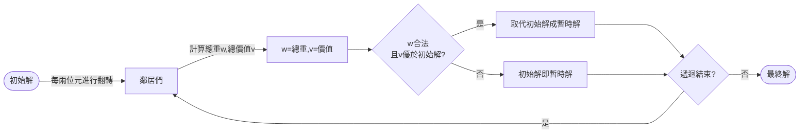

 # 🔵 Ⅰ. 深度學習(Deep Learning)
 ### code review
1. 讀取圖片(train/test data) 
    * 定義分類名稱(form資料夾)
    * 透過loop將所有圖片貼標(分類)，並規格化(resize...)
     ```python
     class_names = ['daisy','dandelion','rose','sunflower','tulip']
    ```
2. 將train/test data 的label,images分出來操作
    * label以int型態儲存
    * images以float型態儲存
    * 將train資料打亂(for隨機性)
    ```python
    X = [] #images
    Y = [] #labels
    for features, labels in data:
        X.append(features)
        Y.append(labels)
    X = np.array(X, dtype = 'float32')
    Y = np.array(Y, dtype = 'int32')
    ```

3. 將分類資訊以pkl(pickle)儲存
    * 下次使用可直接載入使用，省時
   ```python
    #pickle儲存
    pickle.dump(train_images, open('train_images.pkl', 'wb'))
    #pickle讀取
    train_images = pickle.load(open('train_images.pkl', 'rb'))
    ```
    
4. 針對images標準化
    * / 255，因三原色範圍由0-255
   ```python
    train_images = train_images / 255 
    ```    
----
5. 建模


# 🔵 Ⅱ. 超啟發式演算法
## 1. Hill Climbling

### ◻ 方法
1. **流程圖**


### ◻ 想法
* **初始解**：
    * random一範圍1~$2^{n}$ 的數 initNum (decimal)
    * initNum轉為binary並分割成list(array)
    * 計算總重 & 總價值
* **生成鄰居**
    * 基本作法：有一n bit的二進位數，每一bit做翻轉，
        * 例：n=3時，001有 ***1***01、0***1***1，00***0***
        * 需做n次
    * 我的想法：每隔兩位元再做一次翻轉
        * 例：n=5時，01001有 ***1***1001、01***1***01，00100***0***
        * 只需一半的時間，且成效差不多

### ◻ 結果


### ◻ code review
* **架構**
    ```
    |-- Knapsack   
    |--- p07_{c,p,s,w}.txt
    |--- HC.py  #main
    |--- compoents.py  #功能函式s
    |--- varibles.py  #存放global變數&參數設定
    ```

1. **讀取txt檔**
    * 使用f stream讀取權重/容量/
   ```python
    for path in paths:
        f = open(path, 'r')
        if path == 'p07_c.txt' :
            varibles.capcity = int(f.read())
        ......
   ```
2. **Hill Climb演算法**
    * **初始化**
        * random"合法"的初始值/解
        * 並算出總價值&重量
        ```python
            compoents.initialState() #初始值/解

            def initialState():
                pickBound = math.pow(2, int(varibles.objNums/2)) #upperbound: 2^15
                while(1):
                    initNum = format(random.randrange(1, pickBound), 'b') #範圍: 1 - 2^15
                    blist = binToList(initNum) #拆成list
                    (w, v) = calTotalWandV(blist)  #計算weight & value

                    if w <= varibles.capcity: #是否合法
                        ......
        ```    
    * **main：開始執行500次迭代**
        ```python

            while i < varibles.iteraNum:
                stage = compoents.HillClimbing() 
                i += 1
        ```

    * **定義Neighbors鄰居**
        * 每兩位元進行**翻轉**(0→1,1→0)    
        * 若**合法**(重量w符合)，且**更佳**(價值v大於原來的)，則**取代**初始解，成為新的初始解(暫時解)
         ```python

            def HillClimbing():
                temp_state = now_state.copy() #取得初始解
                for i in range(0,varibles.objNums-1 ,2): #每兩位元
                    new_list = now_state['blist'].copy()
                    new_list[i] = int(not new_list[i])
                    (w, v) = calTotalWandV(new_list)
                    if w <= varibles.capcity: #合法
                        if v > temp_v: #新better than 舊
                            ......(取代)  
                #取代初始解,成為新的初始解(暫時解)
                NewState(temp_state['blist'], temp_state['weight'], temp_v)   
        ```
